# Решение задания

1. [Установка ОС](#part-1-установка-ос)  
2. [Создание пользователя](#part-2-создание-пользователя)  
3. [Настройка сети ОС](#part-3-настройка-сети-ос)   
4. [Обновление ОС](#part-4-обновление-ос)  
5. [Использование команды  sudo](#part-5-использование-команды-sudo)  
6. [Установка и настройка службы времени](#part-6-установка-и-настройка-службы-времени)  
7. [Установка и использование текстовых редакторов](#part-7-установка-и-использование-текстовых-редакторов)  
8. [Установка и базовая настройка сервиса SSHD](#part-8-установка-и-базовая-настройка-сервиса-sshd)   
9. [Установка и использование утилит top, htop](#part-9-установка-и-использование-утилит-top-htop)   
10. [Использование утилиты fdisk](#part-10-использование-утилиты-fdisk)   
11. [Использование утилиты df](#part-11-использование-утилиты-df)    
12. [Использование утилиты du](#part-12-использование-утилиты-du)    
13. [Установка и использование утилиты ncdu](#part-13-установка-и-использование-утилиты-ncdu)    
14. [Работа с системными журналами](#part-14-работа-с-системными-журналами)     
15. [Использование планировщика заданий CRON](#part-15-использование-планировщика-заданий-cron)    

## Part 1. Установка ОС

**== Задание ==**

##### Установить **Ubuntu 20.04 Server LTS** без графического интерфейса. (Используем программу для виртуализации - VirtualBox)

- Графический интерфейс должен отсутствовать.

- Узнайте версию Ubuntu, выполнив команду \
`cat /etc/issue.`
- Вставьте скриншот с выводом команды.

**== Решение ==**

- Была установленна программа VirtualBox 

- Вывод текущей версии ОС с помощью команды cat /etc/issue. 
    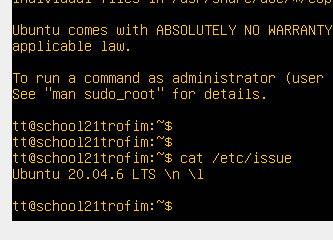
## Part 2. Создание пользователя

**== Задание ==**

##### Создать пользователя, отличного от пользователя, который создавался при установке. Пользователь должен быть добавлен в группу `adm`.

- Вставьте скриншот вызова команды для создания пользователя.
- Новый пользователь должен быть в выводе команды \
`cat /etc/passwd`
- Вставьте скриншот с выводом команды.

**== Решение ==**
- Вызов команды добавления пользователя 
  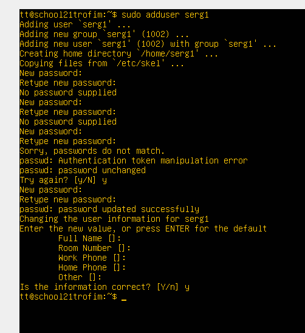
- Вывод команды cat /etc/passwd.  
  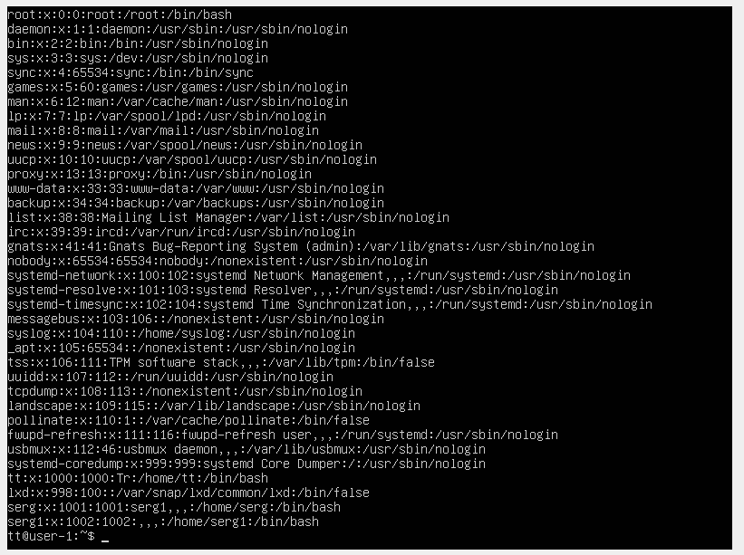
## Part 3. Настройка сети ОС

**== Задание ==**

##### Задать название машины вида user-1  
##### Установить временную зону, соответствующую вашему текущему местоположению.  
##### Вывести названия сетевых интерфейсов с помощью консольной команды.
- В отчёте дать объяснение наличию интерфейса lo.  
##### Используя консольную команду получить ip адрес устройства, на котором вы работаете, от DHCP сервера. 
- В отчёте дать расшифровку DHCP.  
##### Определить и вывести на экран внешний ip-адрес шлюза (ip) и внутренний IP-адрес шлюза, он же ip-адрес по умолчанию (gw). 
##### Задать статичные (заданные вручную, а не полученные от DHCP сервера) настройки ip, gw, dns (использовать публичный DNS серверы, например 1.1.1.1 или 8.8.8.8).  
##### Перезагрузить виртуальную машину. Убедиться, что статичные сетевые настройки (ip, gw, dns) соответствуют заданным в предыдущем пункте.  

- В отчёте опишите, что сделали для выполнения всех семи пунктов (можно как текстом, так и скриншотами).
- Успешно пропинговать удаленные хосты 1.1.1.1 и ya.ru и вставить в отчёт скрин с выводом команды. В выводе команды должна быть фраза "0% packet loss".

**== Решение ==**
 - 3.1 Часовой пояс 
   
- 3.2 Имена сетевых интерфейсов и объеснение для чего нужен lo

  ip link show (что является актуальным в последних версия linux)  ifconfig -a (что является устаревшим вариантом, который использовался в прошлом).  Сетевой интерфейс lo (loopback) это виртуальный сетевой интерфейс, обеспечивает возможность обращения к устройству самому себе(локальный обратный канал).  
Нужен для: 1. Локальный обмен данными испольщуя стандартный сетевой протокол. Например веб-сервер должен обслуживать запросы поступающие с того же компьютера.  
  2. Тестирование сетевых служб, так как они могут общаться с самими собой без использования реальных сетевых интерфейсов. 
  3. Сетевые утилиты ping или localhost используют lo для проверки доступности сетевых служб на том же устройстве. 
  4. Протокол loopback: Все данные отправленные по интерфейсу lo остаются внутри устройства и не покидают его. Это обеспечивает безопасность и избегает необходимости использования реальной сети.
   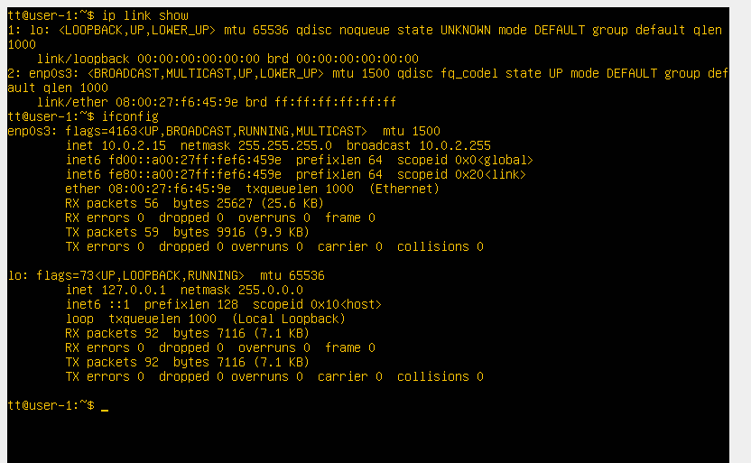
- 3.3  IP-адрес устройства, на котором вы работаете, с сервера DHCP и расшифровка  DHCP
- DHCP- это Dynamic Host Configuration Protocol. (Динамический, так как позволяет автоматически получить конфигурацию сети, включая ip-address, шлюз по умолчанию и другие настройки без необходимости вручную настраивать каждое устройство) 
DHCP (англ. Dynamic Host Configuration Protocol — протокол динамической настройки узла) — сетевой протокол, позволяющий сетевым устройствам автоматически получать IP-адрес и другие параметры, необходимые для работы в сети TCP/IP. Данный протокол работает по модели «клиент-сервер». Для автоматической конфигурации компьютер-клиент на этапе конфигурации сетевого устройства обращается к так называемому серверу DHCP и получает от него нужные параметры. 
 HCP(протокол конфигурации хоста является протоколом который позволяет хостам (компам) получать конфигурацию сети) По факту DHCP протокол который облегчает автоматическое назначение ip-address и других сетевых параметров компьютеров сети

- ip addr show" с помощью этой команды можно вывести ip-address с DCHP сервера. 

 sudo dhclient используется в операционных системах Linux и Unix-подобных для запроса IP-адреса у DHCP-сервера (протокол динамической конфигурации узлов). 

  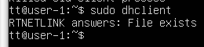
  
 
 - 3.4 Внешний ip-адрес шлюза (ip) и внутренний IP-адрес шлюза.

 - Вывод внешнего ip-address с помощью команды curl ifconfig.me
 - Вывод внутреннего ip-address с помощью команды ip route | grep default   где ip route - это вывод информации о таблице маршрутизации 
 - 
 - 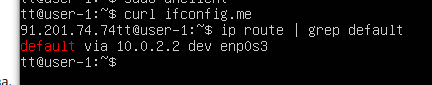

 - 3.5 Задай статичные (заданные вручную, а не полученные от DHCP-сервера) настройки ip, gw, dns (используй публичный DNS-серверы, например 1.1.1.1 или 8.8.8.8).
 - На картинке изображены параметры сетевых параметров. С помощью команды sudo nano /etc/netplan/00-installer-config.yaml я вручную изменил настройки dhcp 

 - 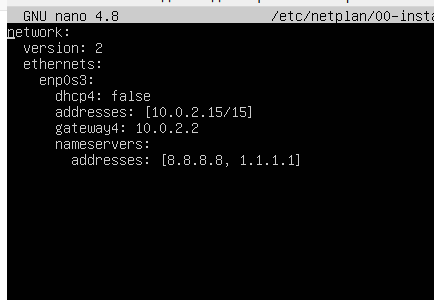
 - Успешно пропингованные 1.1.1.1 и ya.ru 
 - 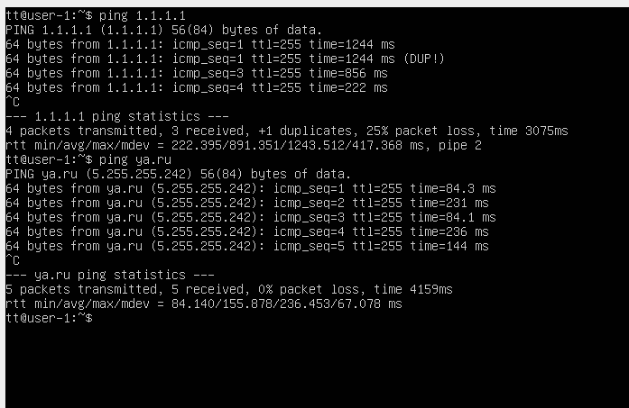
 - Что я сделал для выполнения этого проекты
 - 1 - Начал выполнять первое задание кибербезопасности и в следствии этого многие знания из этого задания помогли выполнить это задание.
 - 2 Многиое я выполнил благодоря прочитанной книги Cisco офицальное руководство для подготовке к сертификации конкретно в этом руководстве было разобранно 3 задание
 - 3 И еще я прочитал и в дальнейшем тоже помоглая, книга Линукс от новичка до профисионала 
 - 4 Ну и конечно же это chatGPT, но я старался не вставлять полностью все задание, а использовал искуственый интелект только чтобы разбираться в терминах

## Part 4. Обновление ОС

**== Задание ==**

##### Обновить системные пакеты до последней на момент выполнения задания версии.  

- После обновления системных пакетов, если ввести команду обновления повторно, должно появится сообщение, что обновления отсутствуют.
- Вставить скриншот с этим сообщением в отчёт.

**== Решение ==**
- Скриншот что все обновленно
- 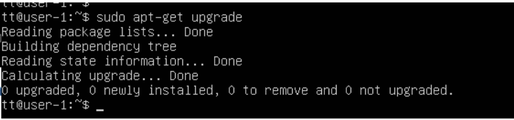
- 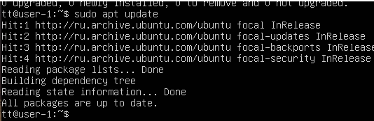

## Part 5. Использование команды **sudo**

**== Задание ==**

##### Разрешить пользователю, созданному в [Part 2](#part-2-создание-пользователя), выполнять команду sudo.

- В отчёте объяснить *истинное* назначение команды sudo (про то, что это слово - "волшебное", писать не стоит).  
- Поменять hostname ОС от имени пользователя, созданного в пункте [Part 2](#part-2-создание-пользователя) (используя sudo).
- Вставить скрин с изменённым hostname в отчёт.

**== Решение ==**
 - Что такое sudo - проще говоря это слово пишем когда хотим выполнить действие как суперпользователь.
 - Пример: хотим снести линукс или загрузить какие-то пакеты или что-нибудь запрещенистое то без прав суперпользователя нам этого не сделать.
 - Как я вычетал из книги из того что права у суперпользователя слишком всеобемлющие поэтому во многих дистрибутивах линукса(включая ubunty) нет акаунта суперпользователя
 - И чтобы работать как суперпользователь и придумали волшебное слово sudo
- 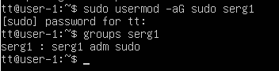
- 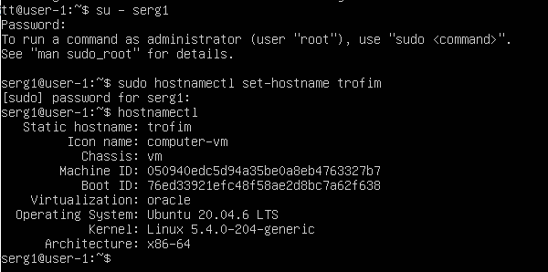

## Part 6. Установка и настройка службы времени

**== Задание ==**

##### Настроить службу автоматической синхронизации времени.  

- Вывести время, часового пояса, в котором вы сейчас находитесь.
- Вывод следующей команды должен содержать `NTPSynchronized=yes`: \
  `timedatectl show`
- Вставить скрины с корректным временем и выводом команды в отчёт.

**== Решение ==**
- 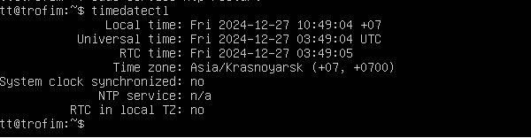
- 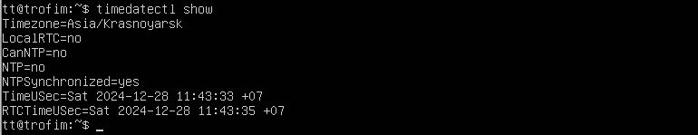

## Part 7. Установка и использование текстовых редакторов 

**== Задание ==**

##### Установить текстовые редакторы **VIM** (+ любые два по желанию **NANO**, **MCEDIT**, **JOE** и т.д.)  
##### Используя каждый из трех выбранных редакторов, создайте файл *test_X.txt*, где X -- название редактора, в котором создан файл. Напишите в нём свой никнейм, закройте файл с сохранением изменений.  
- В отчёт вставьте скриншоты:
  - Из каждого редактора с содержимым файла перед закрытием.
- В отчёте укажите, что сделали для выхода с сохранением изменений.
##### Используя каждый из трех выбранных редакторов, откройте файл на редактирование, отредактируйте файл, заменив никнейм на строку "21 School 21", закройте файл без сохранения изменений.
- В отчёт вставьте скриншоты:
    - Из каждого редактора с содержимым файла после редактирования.
- В отчёте укажите, что сделали для выхода без сохранения изменений.
##### Используя каждый из трех выбранных редакторов, отредактируйте файл ещё раз (по аналогии с предыдущим пунктом), а затем освойте функции поиска по содержимому файла (слово) и замены слова на любое другое.
- В отчёт вставьте скриншоты:
    - Из каждого редактора с результатами поиска слова.
    - Из каждого редактора с командами, введёнными для замены слова на другое.

**== Решение ==**
 ### Vim
 - 1- С помощью команды vim test_vim.txt вошел в текстовый файл включил редакционый режим с помощью i потом написал greenfib и вышел с сохранением с помощью :wq
 - 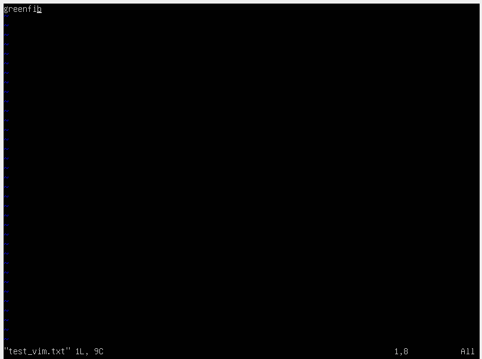
 - 2 Вошел в текстовый файл написал 21 school 21 и вышел без сохранения с помощью :q!
 - 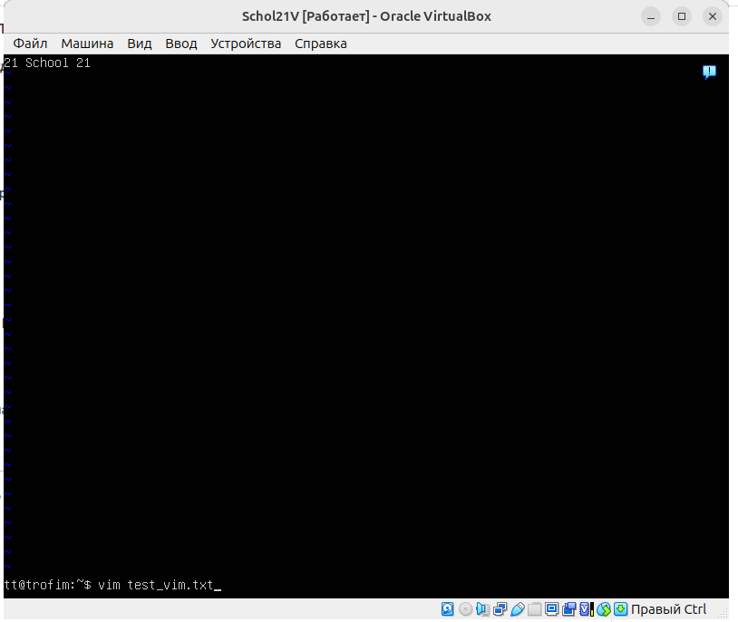
 - 3 Изменил слово greenfib на 21 School 21 сохранился и вышел.
 - 3.1 Научился искать. Символ / указывает на то, что вы хотите выполнить поиск.
 - 3.2 научился заменять слова :%s/21 School 21/greenfib
 -  : — начинает ввод команды.
 -  % — указывает, что замена будет произведена во всем файле. 
 -  s — означает "заменить"
 - /21 School 21/ — это слово, которое вы хотите заменить.
 - greenfib это слово на что хотите заменить
 - 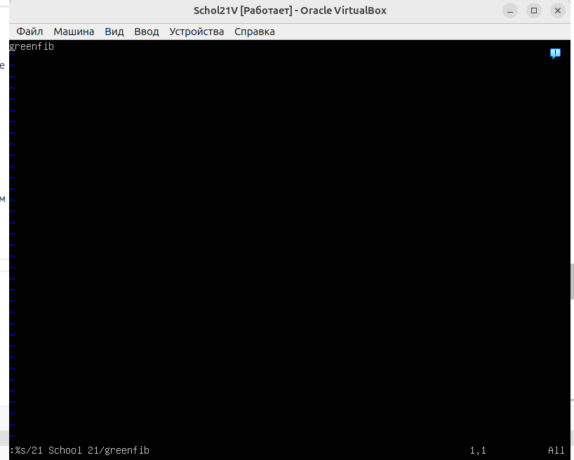
 ### Nano
- установил  sudo apt install vim nano mcedit

 #### 1
- С помощью команды  nano test_nano.txt входим в текстовый файл
  - Пишем никнейм
  - Для выхода с сохранением изменений нажал `Ctrl + X`, затем `Y`, и `Enter`.
  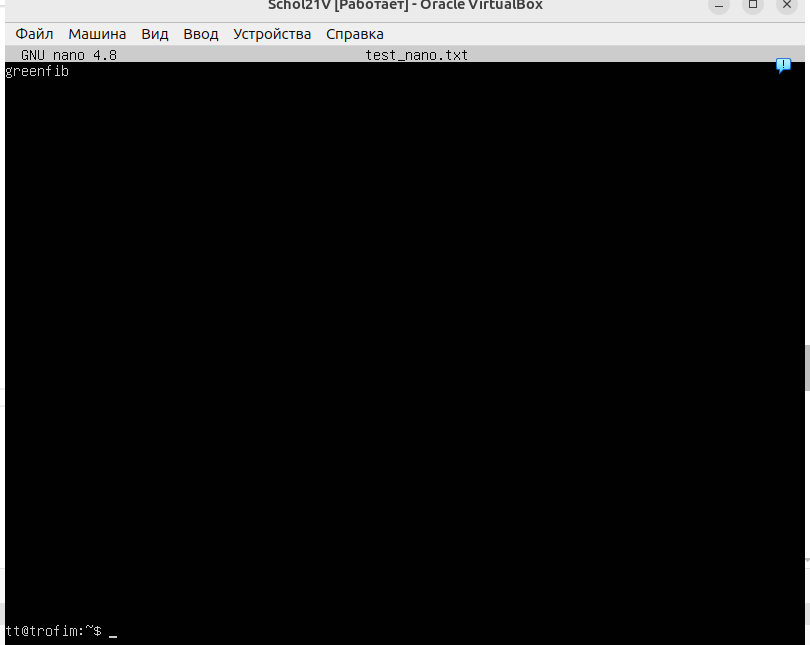
 #### 2
 - С помощью команды  nano test_nano.txt входим в текстовый файл
 - Пишем 21 School 21
 - Для выхода без сохранения изменений нажал `Ctrl + X`, затем `N`.
  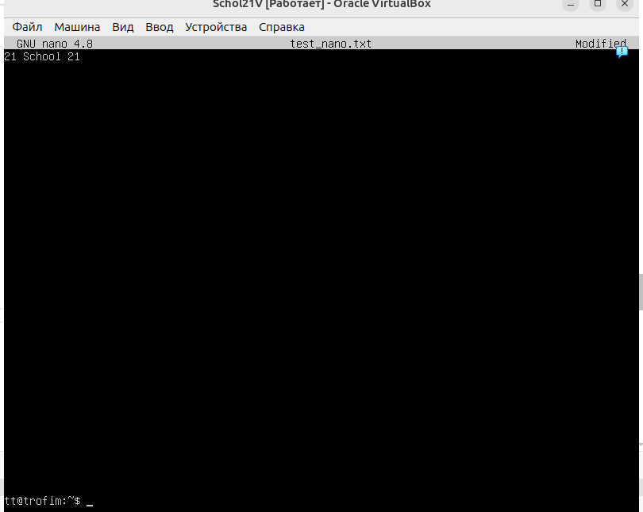
 #### 3
-  Поиск слова Нажмите комбинацию клавиш Ctrl + W.
-  Замена слова Ctrl + \ и потом сначало слово которое хотим заменить а дальше на что хотим заменить
  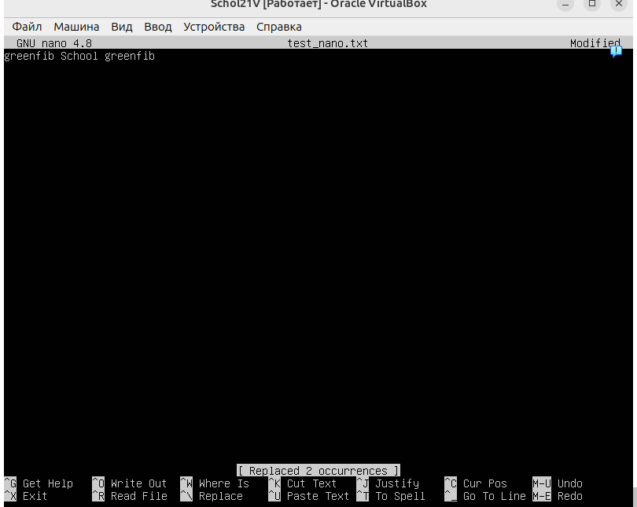

### EMACS
-С помощью команды  nano test_emacs.txt входим в текстовый файл
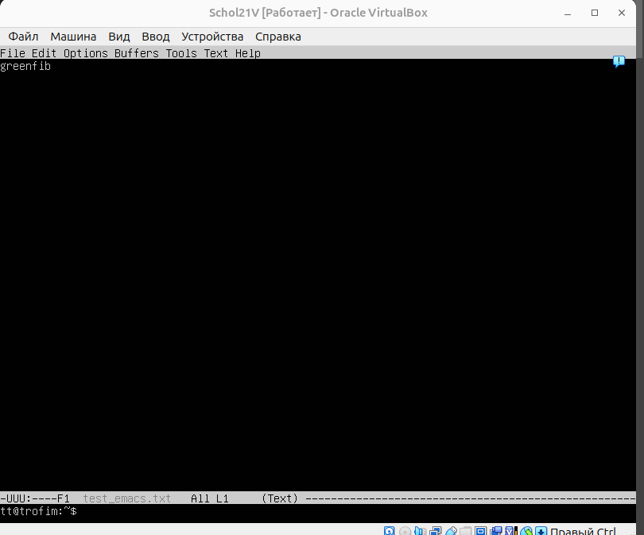
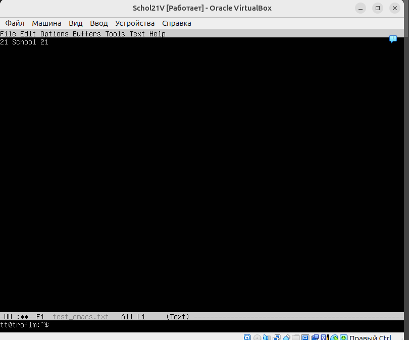
 Нажмите Ctrl + X, затем Ctrl + S для сохранения файла. 
 Затем нажмите Ctrl + X, затем Ctrl + C, чтобы выйти из Emacs. 
 Закрытие файла без сохранения изменений нажмите Ctrl + X, затем Ctrl+C. 
-Для поиска Ctrl + S
- для замены alt+shift+5

## Part 8. Установка и базовая настройка сервиса **SSHD**

**== Задание ==**

##### Установить службу SSHd.  
##### Добавить автостарт службы при загрузке системы.  
##### Перенастроить службу SSHd на порт 2022.  
##### Используя команду ps, показать наличие процесса sshd. Для этого к команде нужно подобрать ключи.
- В отчёте объяснить значение команды и каждого ключа в ней.
##### Перезагрузить систему.
- В отчёте опишите, что сделали для выполнения всех пяти пунктов (можно как текстом, так и скриншотами).
- Вывод команды netstat -tan должен содержать  \
`tcp 0 0 0.0.0.0:2022 0.0.0.0:* LISTEN`  \
(если команды netstat нет, то ее нужно установить)
- Скрин с выводом команды вставить в отчёт.
- В отчёте объяснить значение ключей -tan, значение каждого столбца вывода, значение 0.0.0.0.

**== Решение ==**

- 1 Для установки службы SSHd я ввел sudo apt install openssh-server 
- 2 Автостарт службы при загрузке системы я ввел команды  проверка статуса службы sudo systemctl status ssh  это команда покажет, запущена ли служба SSH и затем ввел sudo systemctl enable ssh команда добавляет автостарт
- 3 sudo nano /etc/ssh/sshd_config открывание файла редактируем порт 22 на 2022 и рестарт sudo systemctl restart ssh

- 4
    
   ps aux | grep sshd 

  Вот полный список ключей для команды ps: 
  ps: команда для отображения текущих процессов 
 grep - вытаскивает строчку по конкретному имени в данном случае sshd. 
 a - Показывать процессы всех пользователей, кроме системных. 
 u - Показывать процессы, запущенные пользователем. 
 x - Показывать процессы, не являющиеся терминальными. 
 | - знак разделитель команд. 

- 5 sudo reboot рестарт операционки 
- 6 

    sudo apt install net-tools установка если нет

    netstat -tan  проверка открытых портов  
    t : Показывать только TCP-соединения. 
    a : Показывать все (активные и неактивные) соединения. 
    n : Выводить числовые адреса вместо имен. 
   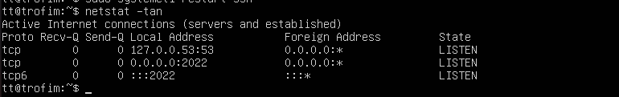  
Значение каждого столбца вывода: 
    Proto : Протокол (TCP, UDP и т.д.). 
Recv-Q : Длина очереди приема данных для соединения. 
Send-Q : Длина очереди отправки данных для соединения. 
Local Address : Локальный адрес и порт. 
Foreign Address : Внешний адрес и порт. 
State : Состояние соединения. 
Значение 0.0.0.0: 
В столбцах Local Address и Foreign Address значение 0.0.0.0 указывает на то, что соединение ассоциировано с любым доступным сетевым интерфейсом на устройстве. Это означает, что служба или приложение прослушивает все интерфейсы и адреса на устройстве, а также может взаимодействовать с любым внешним адресом и портом. 
Что помогло решить это задание https://losst.pro/nastrojka-ssh-v-debian. 
https://losst.pro/kak-polzovatsya-ssh

## Part 9. Установка и использование утилит **top**, **htop**

**== Задание ==**

##### Установить и запустить утилиты top и htop.  

- По выводу команды top определить и написать в отчёте:
  - uptime
  - количество авторизованных пользователей
  - общую загрузку системы
  - общее количество процессов
  - загрузку cpu
  - загрузку памяти
  - pid процесса занимающего больше всего памяти
  - pid процесса, занимающего больше всего процессорного времени

- В отчёт вставить скрин с выводом команды htop:
  - отсортированному по PID, PERCENT_CPU, PERCENT_MEM, TIME
  - отфильтрованному для процесса sshd
  - с процессом syslog, найденным, используя поиск 
  - с добавленным выводом hostname, clock и uptime  

**== Решение ==**

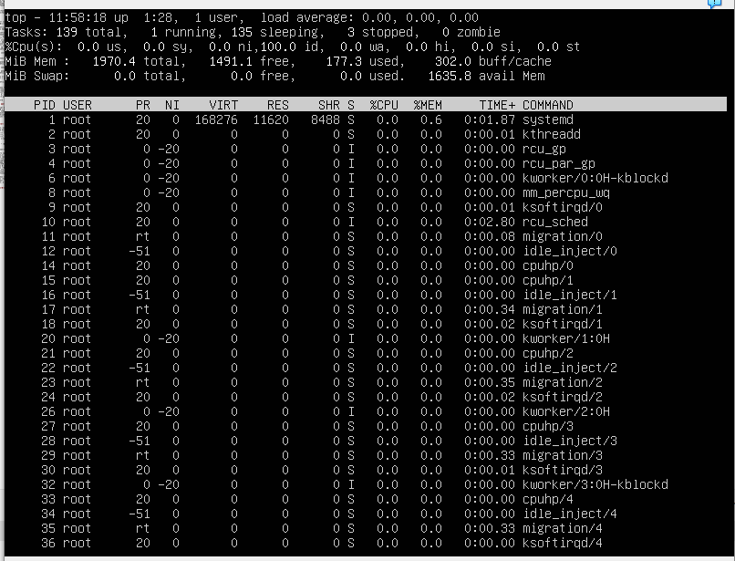  
- uptime - 1:28 .
- количество авторизованных пользователей - 1 user
- общую загрузку системы - load average: 0.00, 0.00, 0.00
- общее количество процессов - 139
- загрузку cpu - 0.0 us, 0.0 sy, 0.0 ni, 100 id, 0.0 wa, 0.0 hi, 0.0 si, 0.0 st.
- загрузку памяти - 177.3 used, 302.0 buff / cache.
- pid процесса занимающего больше всего памяти - 1
- pid процесса, занимающего больше всего процессорного времени - %cpu все по нулям

-Отсортированые по PID, PERCENT_CPU, PERCENT_MEM, TIME
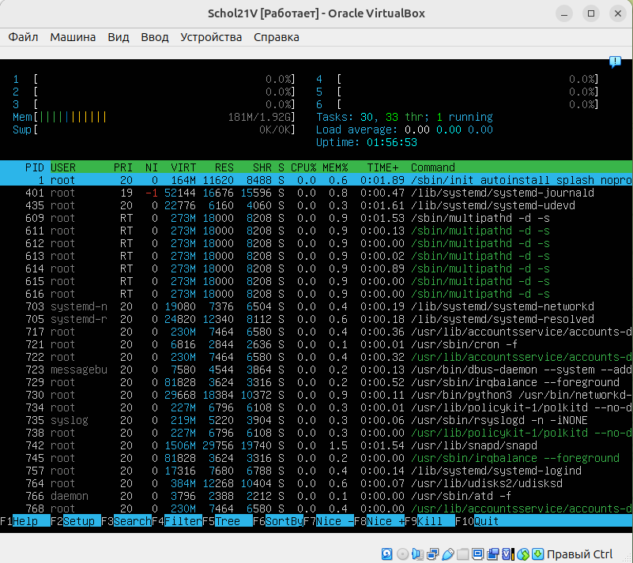  
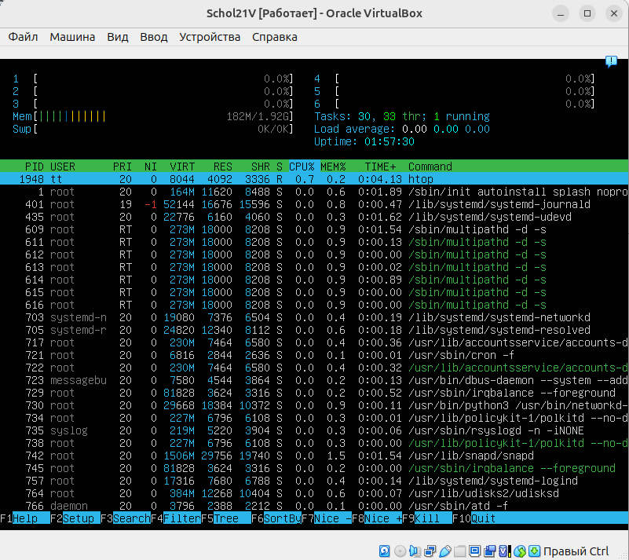  
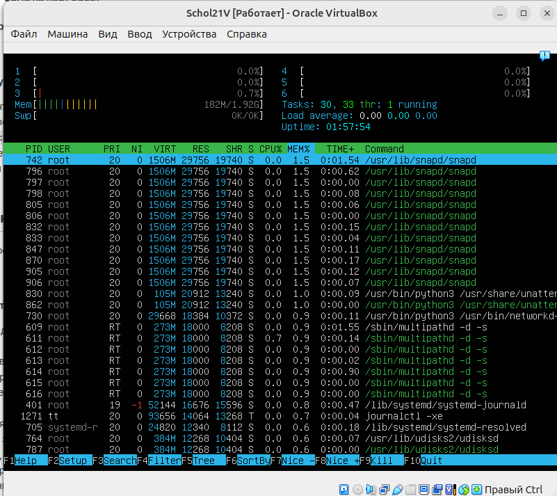  
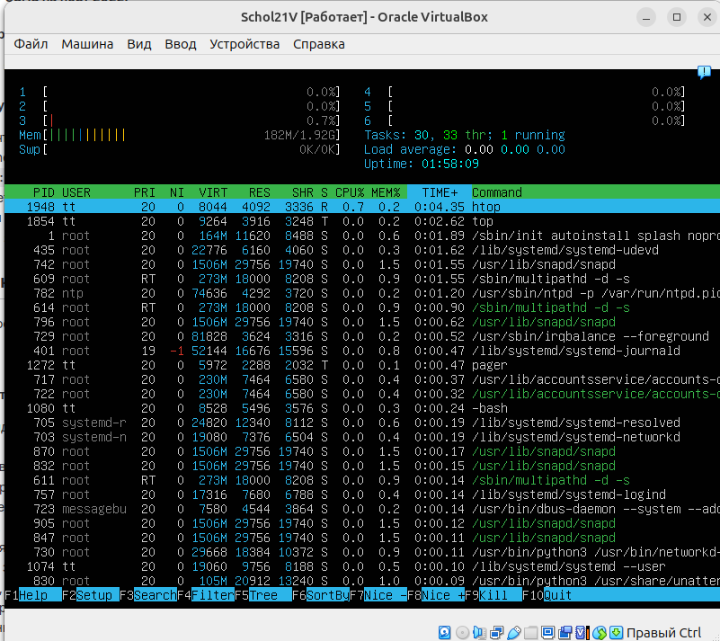  

- Отфильтрованному для процесса sshd 
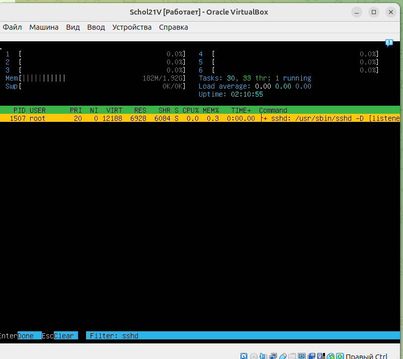  
- С процессом syslog, найденным, используя поиск 
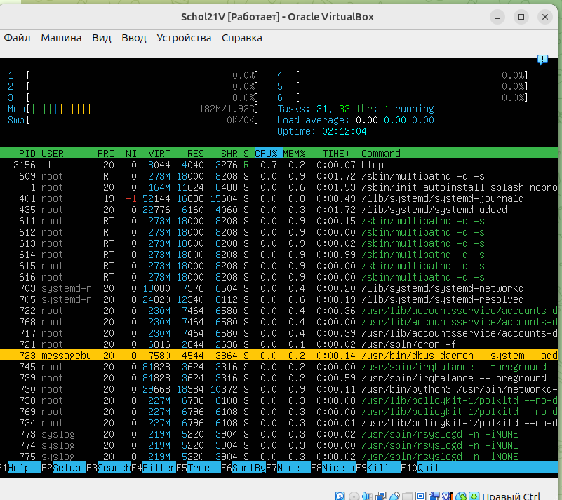  
- C добавленным выводом hostname, clock и uptime. 
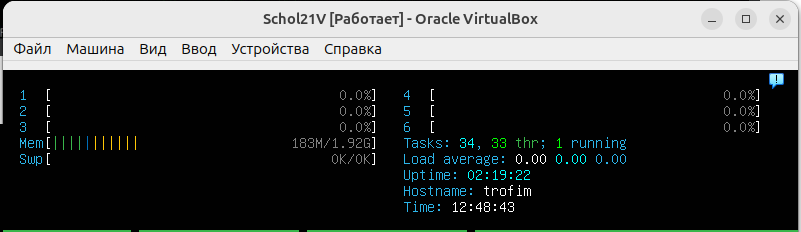  

## Part 10. Использование утилиты **fdisk**

**== Задание ==**

##### Запустить команду fdisk -l.

- В отчёте написать название жесткого диска, его размер и количество секторов, а также размер swap.

**== Решение ==**

Название жесткого диска: /dev/sda 
Размер жесткого диска: 6.46 GiB 
Количество секторов: 13533176 
Размер swap: swap в системе отсутствует ну либо ноль 

## Part 11. Использование утилиты **df** 

**== Задание ==**

##### Запустить команду df.  
- В отчёте написать для корневого раздела (/):
  - размер раздела
  - размер занятого пространства
  - размер свободного пространства
  - процент использования
- Определить и написать в отчёт единицу измерения в выводе.  

##### Запустить команду df -Th.
- В отчёте написать для корневого раздела (/):
    - размер раздела
    - размер занятого пространства
    - размер свободного пространства
    - процент использования
- Определить и написать в отчёт тип файловой системы для раздела.

**== Решение ==**

### df
-  Размер раздела: 4761224 K 

- Размер занятого пространства: 3565616 K 

- Размер свободного пространства: 933056 K 

- Процент использования: 80%

Единица измерения: K (килобайты)

### df -Th
 - Размер раздела: 4.6G

  - Размер занятого пространства: 3.5G

  - Размер свободного пространства: 912M

  - Процент использования: 80%

  - Тип файловой системы: ext4   

  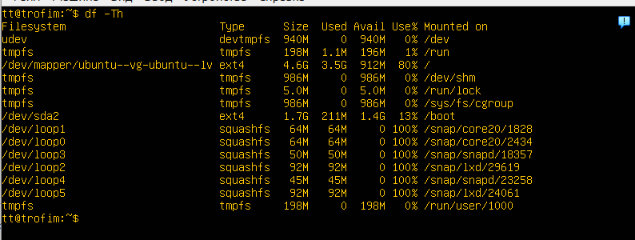  

## Part 12. Использование утилиты **du**

**== Задание ==**

##### Запустить команду du.
##### Вывести размер папок /home, /var, /var/log (в байтах, в человекочитаемом виде)
##### Вывести размер всего содержимого в /var/log (не общее, а каждого вложенного элемента, используя *)

- В отчёт вставить скрины с выводом всех использованных команд.

**== Решение ==**

 - Вывод команды du 
    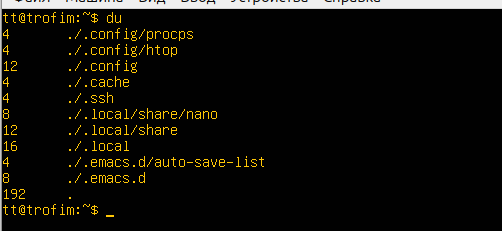  
 - Вывод команды sudo du /home/ в байтах 
    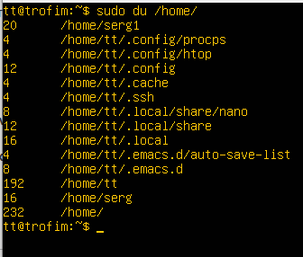  
 - Вывод команды sudo du -h /home/ 
 - Ключ -h означает вывести в человекоудобном читаемом виде. 
    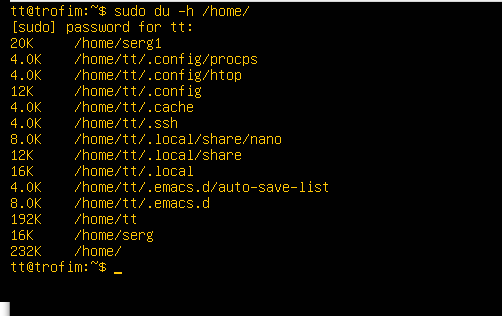  
 - Вывод команды sudo du /var/ в байтах. 
    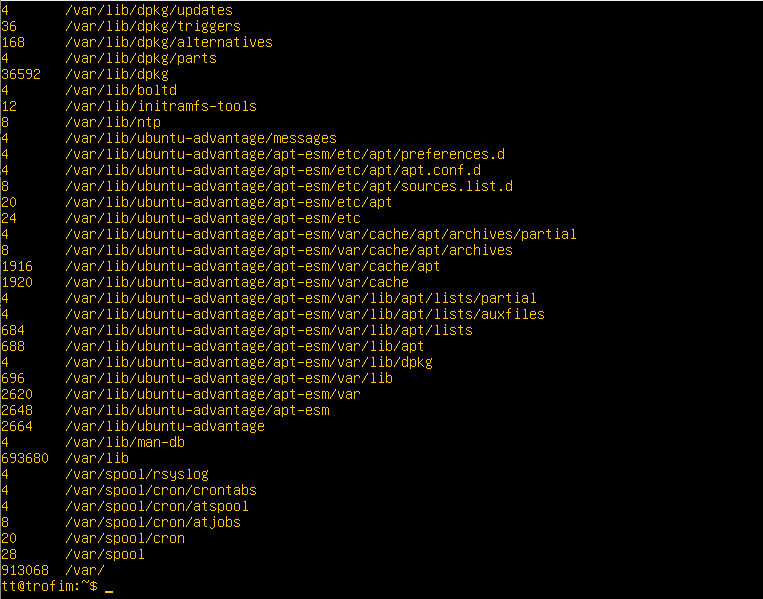  
 - Вывод команды sudo du -h /var/ в человекоудобном читаемом виде. 
    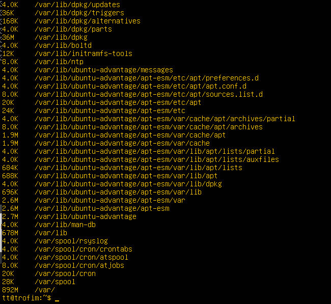  
 - Вывод команды sudo du  /var/log  в байтах  
    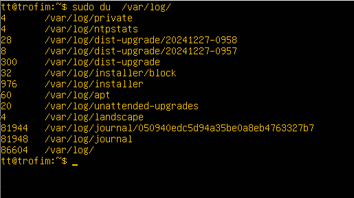  
 - Вывод команды sudo du -h /var/log в человекоудобном читаемом виде.  
    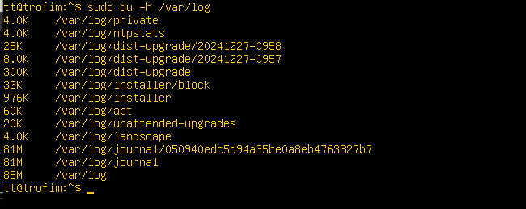  
 - Вывод команды sudo du -h /var/log/* в человекоудобном читаемом виде.  
    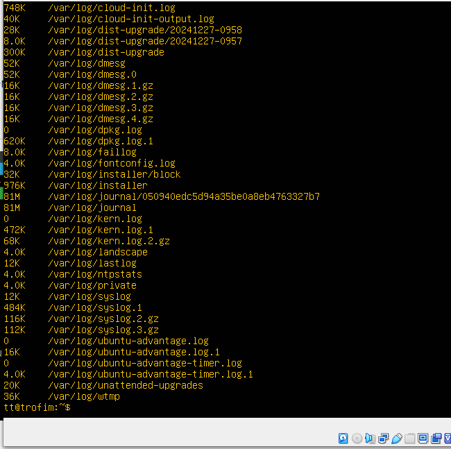  

## Part 13. Установка и использование утилиты **ncdu**

**== Задание ==**

##### Установить утилиту ncdu.
##### Вывести размер папок /home, /var, /var/log.

- Размеры должны примерно совпадать с полученными в [Part 12](#part-12-использование-утилиты-du).

- В отчёт вставить скрины с выводом использованных команд.

**== Решение ==**

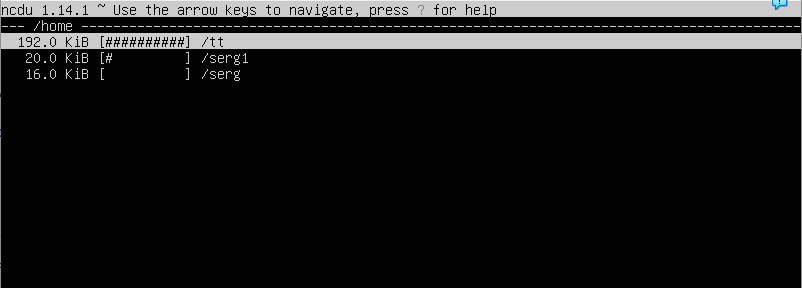  
- Вывод команды ncdu /home/  
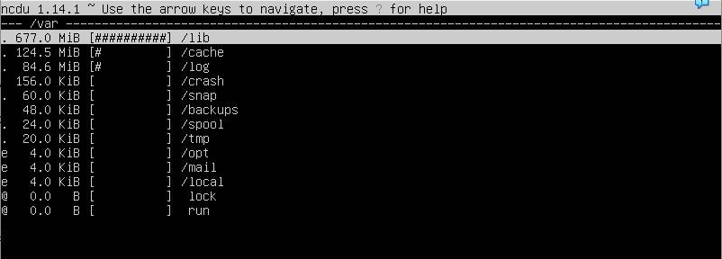  
- Вывод команды ncdu /var/  
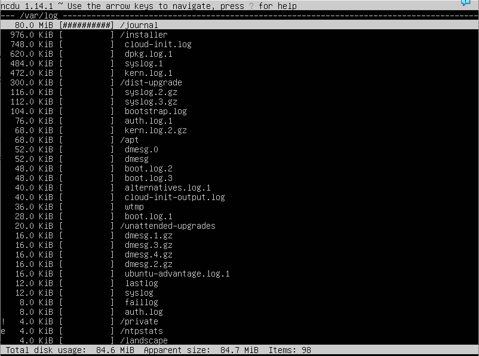  
- Вывод команды ncdu /var/log  

## Part 14. Работа с системными журналами

**== Задание ==**

##### Открыть для просмотра:
##### 1. /var/log/dmesg
##### 2. /var/log/syslog
##### 3. /var/log/auth.log  

- Написать в отчёте время последней успешной авторизации, имя пользователя и метод входа в систему.
- Перезапустить службу SSHd.
- Вставить в отчёт скрин с сообщением о рестарте службы (искать в логах).

**== Решение ==**
- 3 june 3.01.2024 23:32:25 время и дата
- tt имя пользователя 
- shh метод выхода

  

## Part 15. Использование планировщика заданий **CRON**

**== Задание ==**

##### Используя планировщик заданий, запустите команду uptime через каждые 2 минуты.
- Найти в системных журналах строчки (минимум две в заданном временном диапазоне) о выполнении.
- Вывести на экран список текущих заданий для CRON.
- Вставить в отчёт скрины со строчками о выполнении и списком текущих задач.

##### Удалите все задания из планировщика заданий.
- В отчёт вставьте скрин со списком текущих заданий для CRON.

**== Решение ==**
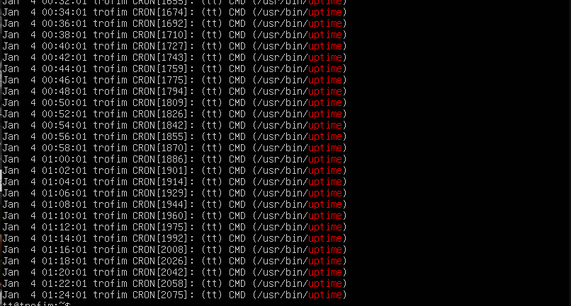  
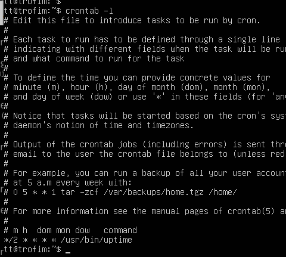  
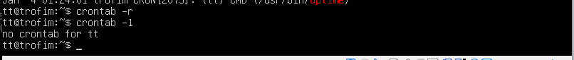  

